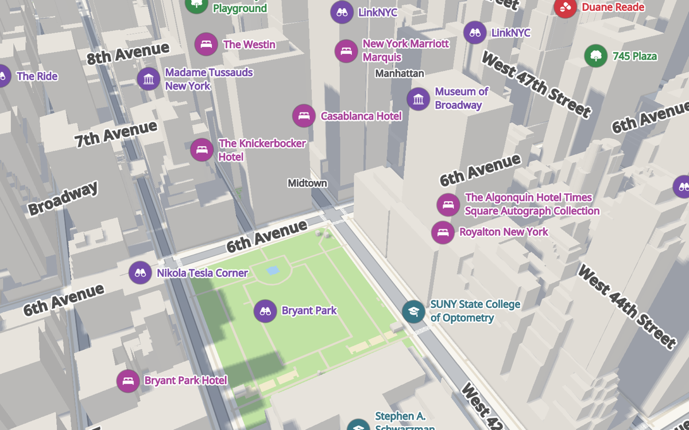
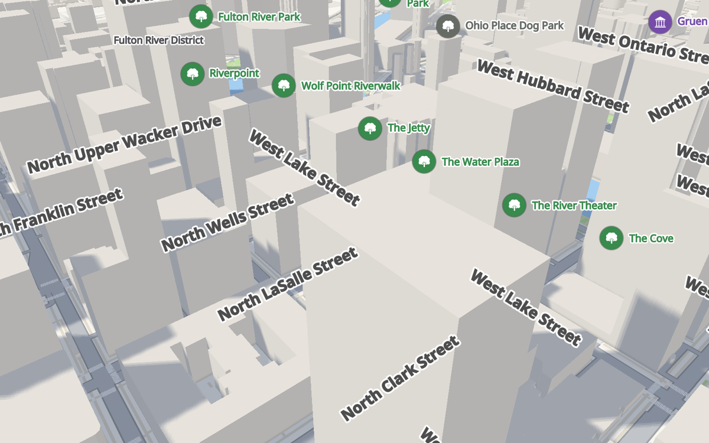
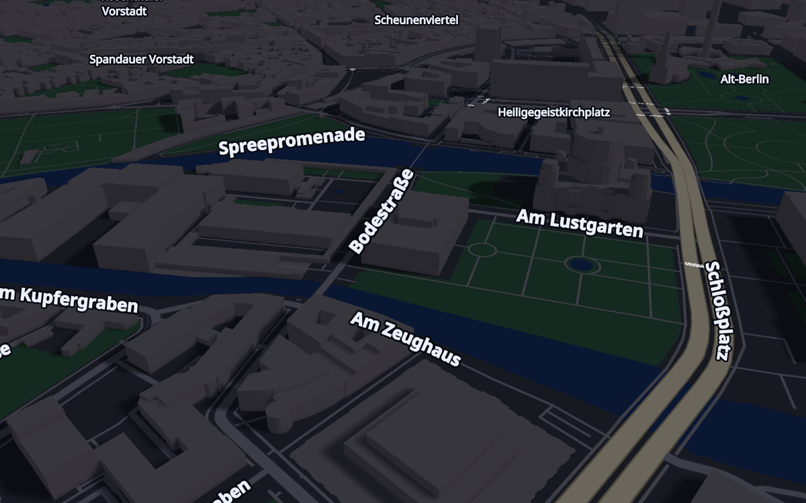
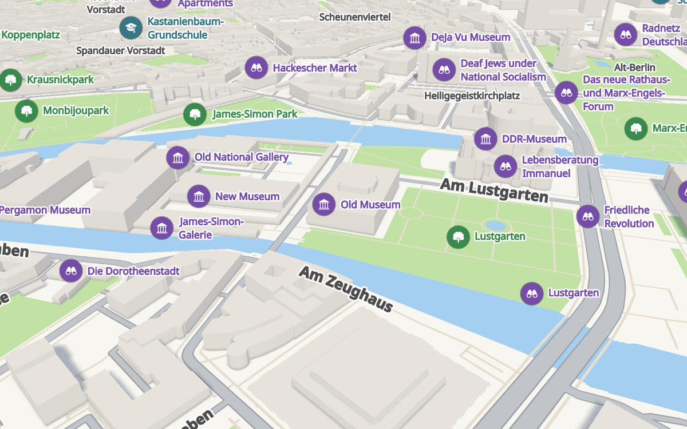
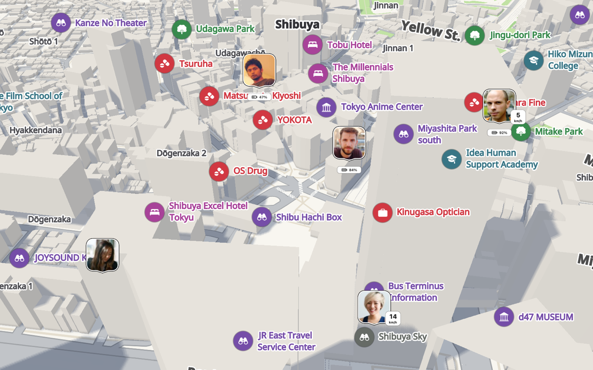
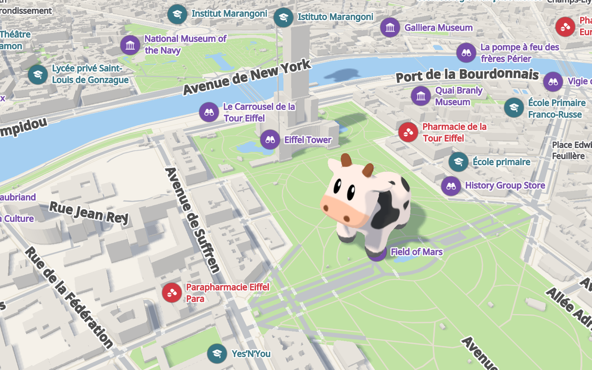
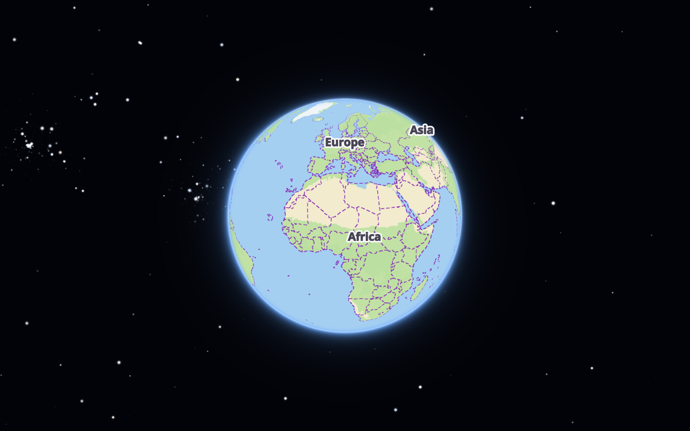
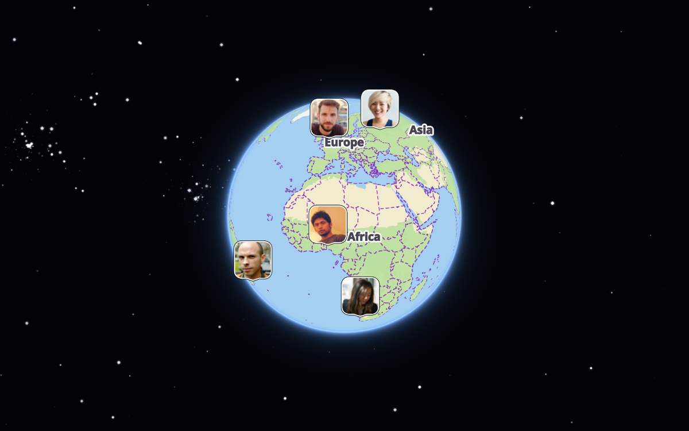

# ImmersiveMap

[](https://github.com/artembobkin/ImmersiveMap/actions/workflows/ci.yml) [](https://swiftpackageindex.com/artembobkin/ImmersiveMap) [](https://swiftpackageindex.com/artembobkin/ImmersiveMap) [](https://github.com/artembobkin/ImmersiveMap/tags) [](LICENSE)

ImmersiveMap is a **pure Swift + Metal map** rendering engine for **SwiftUI apps** on Apple platforms.

<p align="center">
  
  
</p>
<p align="center">
  
  
</p>
<p align="center">
  
  
</p>
<p align="center">
  
  
</p>
<p align="center">
  
  
</p>

## Features

Built-in Protomaps vector tiles, native iOS (UIKit host), native macOS, SwiftUI integration, map styling and colors, SwiftUI markers, avatars, 3D scene models, landmark models that replace the map's buildings, tour video export.

## Map Data

The map draws the Protomaps basemap, an OpenStreetMap planet in a single PMTiles archive that the engine reads with HTTP range requests, with no tile server in between. The archive hosted for this project is the default, and `.tileArchive(_:headers:)` points the map at any [Protomaps planet build](https://maps.protomaps.com/builds/) or a region cut from one.

## Quick Start

```swift
import SwiftUI
import ImmersiveMap

struct ContentView: View {
    @State private var camera = ImmersiveMapCameraController()

    var body: some View {
        ImmersiveMapView()
            .cameraController(camera)
            .enableCameraUIControls()
            .ignoresSafeArea()
    }
}
```

## Installation

Add ImmersiveMap as a Swift Package dependency:

```text
https://github.com/artembobkin/ImmersiveMap.git
```

## Requirements

- Swift 6.0+
- Xcode 16+
- iOS 18+
- macOS 15+
- Metal-capable device or simulator

## Attribution

"© OpenStreetMap" is required if you use the built-in tiles, which are OpenStreetMap data. Otherwise the license is MIT and nothing here changes that. It would just be cool if you mention ImmersiveMap somewhere:

```text
Maps powered by ImmersiveMap (immersivemap.dev)
```

## Contributing

ImmersiveMap is currently maintained as a single-maintainer project. Issues and feedback are welcome. Pull requests are accepted. For bug reports, feature requests, questions and ideas, open an [issue](https://github.com/artembobkin/ImmersiveMap/issues).

## License

ImmersiveMap is available under the MIT license. See [LICENSE](LICENSE). The internal earcut triangulator is a port of ISC-licensed Mapbox code, and its notice heads [EarcutCore.swift](Sources/Earcut/EarcutCore.swift).

## Commercial Support

I am available for consulting and custom ImmersiveMap integrations. To get in touch, open an [issue](https://github.com/artembobkin/ImmersiveMap/issues/new).
