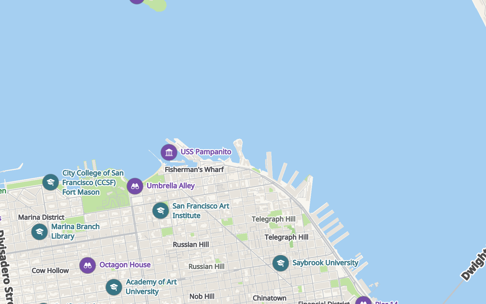
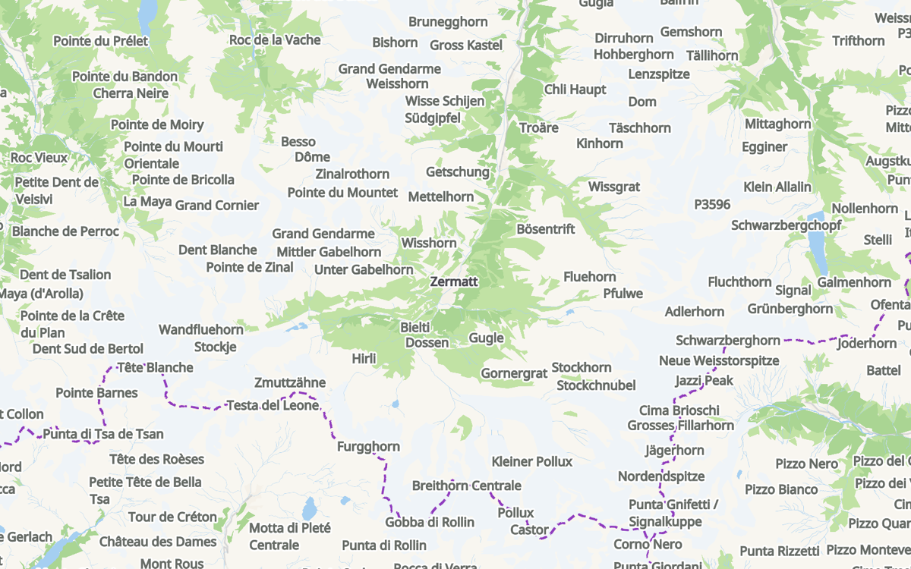

# ImmersiveMap

[](https://github.com/artembobkin/ImmersiveMap/actions/workflows/ci.yml) [](https://swiftpackageindex.com/artembobkin/ImmersiveMap) [](https://swiftpackageindex.com/artembobkin/ImmersiveMap) [](https://github.com/artembobkin/ImmersiveMap/tags) [](LICENSE)

ImmersiveMap is a **pure Swift + Metal map** rendering engine for **SwiftUI apps** on Apple platforms, about +6 MB of app size.

<p align="center">
  
  
</p>
<p align="center">
  
  
</p>

## Performance

iPhone 15 Pro Max, iOS 26.5, 120 Hz. Scripted session: city flights at zoom 14 to 16.5
with tilt, a 20 second pan, an idle map.

| Metric | Result |
|---|---:|
| Frame rate on screen | 119 to 120 fps |
| GPU per frame | 4.5 to 4.7 ms |
| CPU, pan | 40 % of one core |
| CPU, idle | 1 %, no frames drawn |
| Memory, moving | 240 to 290 MB |
| Memory, idle | 170 to 220 MB |
| First map view, main thread | 60 to 75 ms |

Measured with `Tools/PerformanceBench` on one device; rerun before quoting for another.

## Features

[Built-in vector tiles](Documentation/docs/map-data.md), native iOS (UIKit host), native macOS (AppKit host, no Catalyst), SwiftUI integration, [map styling and colors](Documentation/docs/styling.md), [the streetscape](Documentation/docs/streetscape.md), [SwiftUI markers](Documentation/docs/markers.md), [avatars](Documentation/docs/avatars.md), [3D scene models](Documentation/docs/scene-models.md), [tour video export](Documentation/docs/tour-video-export.md).

## Quick Start

```swift
import SwiftUI
import ImmersiveMap

struct ContentView: View {
    @State private var camera = ImmersiveMapCameraController()

    var body: some View {
        ImmersiveMapView()
            .cameraController(camera)
            .enableCameraUIControls()
            .ignoresSafeArea()
    }
}
```

## Installation

Add ImmersiveMap as a Swift Package dependency:

```text
https://github.com/artembobkin/ImmersiveMap.git
```

## Requirements

- Swift 6.0+
- Xcode 16+
- iOS 18+
- macOS 15+
- Metal-capable device or simulator

## Attribution

"© OpenStreetMap" is required if you use the built-in tile provider. Otherwise the license is MIT and nothing here changes that. It would just be cool if you mention ImmersiveMap somewhere:

```text
Maps powered by ImmersiveMap (immersivemap.dev)
```

## Contributing

ImmersiveMap is currently maintained as a single-maintainer project. Issues and feedback are welcome. Pull requests are accepted. See [CONTRIBUTING.md](CONTRIBUTING.md). Bug reports and feature requests belong in [Issues](https://github.com/artembobkin/ImmersiveMap/issues). Questions, ideas, and anything open-ended belong in [Discussions](https://github.com/artembobkin/ImmersiveMap/discussions).

## License

ImmersiveMap is available under the MIT license. See [LICENSE](LICENSE). The internal earcut triangulator is a port of ISC-licensed Mapbox code; its notice, ready to copy into an app's acknowledgements screen, is in [THIRD-PARTY-NOTICES.md](THIRD-PARTY-NOTICES.md).

## Commercial Support

I am available for consulting and custom ImmersiveMap integrations. To get in touch, start a [discussion](https://github.com/artembobkin/ImmersiveMap/discussions), or write to me in the chat at [immersivemap.dev/account](https://immersivemap.dev/account/).
